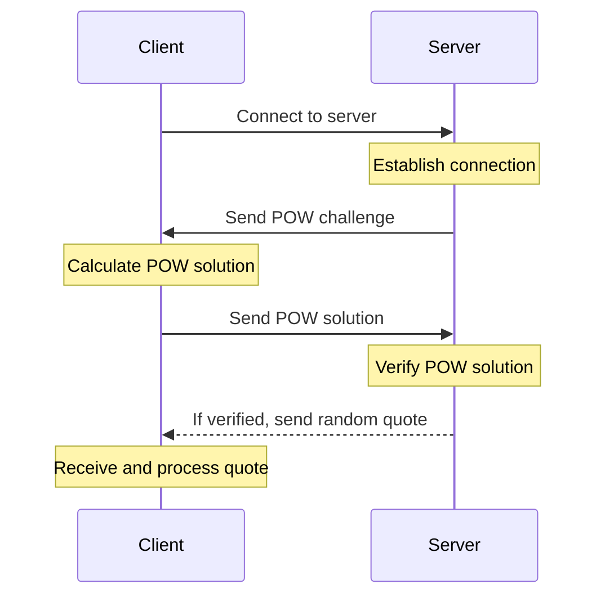

# Word of Wisdom

## Overview

## Docs

- [Task description](docs/task.md)

## Sequence diagram

## Getting started

## Resources

<table>
<thead>
  <tr>
      <th><b>Resource</b></th>
      <th><b>Details</b></th>
  </tr>
</thead>
<tbody>
  <tr>
    <td><a href="https://en.wikipedia.org/wiki/Proof_of_work" target="_blank" rel="noopener noreferrer">Proof of work</a></td>
    <td>A form of cryptographic proof in which one party (the prover) proves to others (the verifiers) that a certain amount of a specific computational effort has been expended.</td>
  </tr>
  <tr>
    <td><a href="https://en.wikipedia.org/wiki/Hashcash" target="_blank" rel="noopener noreferrer">Hashcash</a></td>
    <td>A cryptographic hash-based proof-of-work algorithm that requires a selectable amount of work to compute.</td>
  </tr>
</tbody>
</table>

