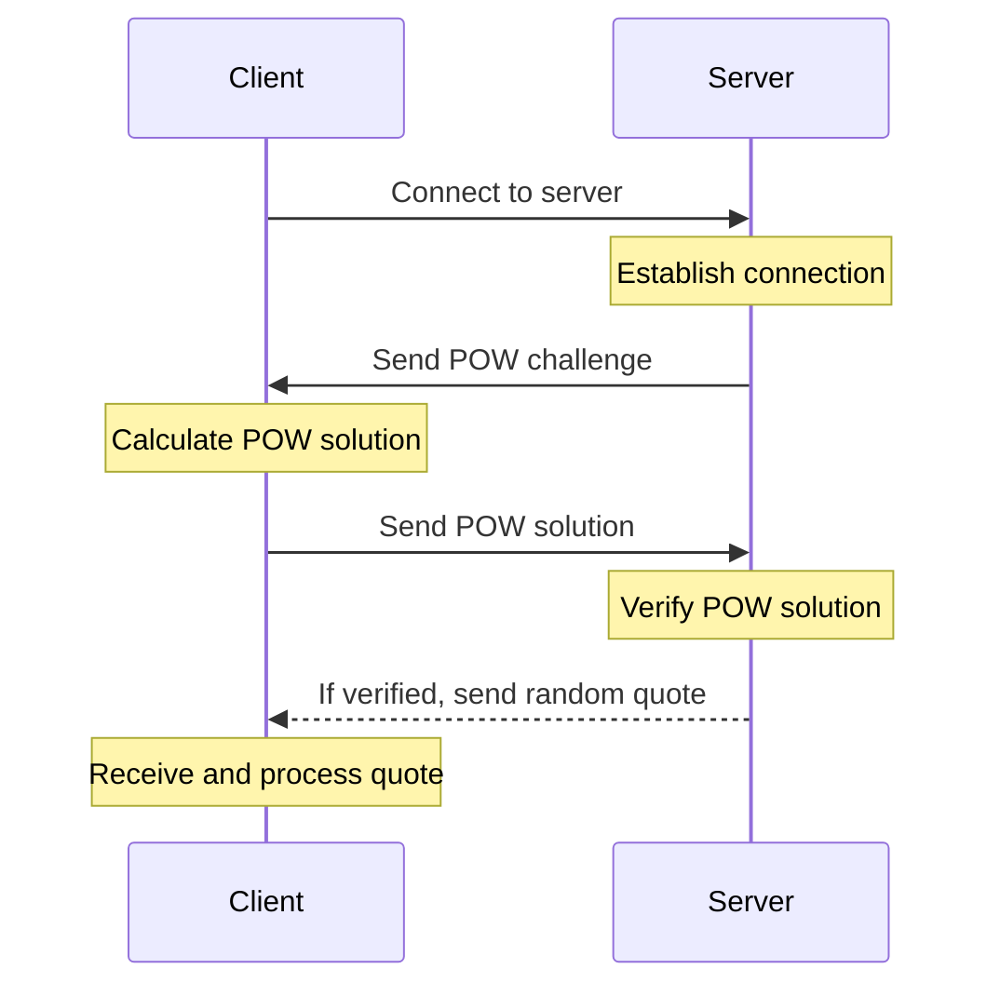

# Word of Wisdom

## Overview

The "Word of Wisdom" project combines secure server-client communication with the Proof of Work protocol to safeguard
against DDoS attacks.
Clients solve computational challenges to access quotes, ensuring a secure exchange.

## Docs

- [Task description](docs/task.md)

## Sequence diagram

## Choice of Proof of Work Algorithm

For securing the "Word of Wisdom" TCP server against DDoS attacks, we've chosen the Hashcash algorithm. This decision
was based on its proven effectiveness in similar applications and its straightforward implementation. Below is a summary
of Hashcash's key advantages and disadvantages that influenced our choice:

| Advantages                                                                                         | Disadvantages                                                                                                |
|----------------------------------------------------------------------------------------------------|--------------------------------------------------------------------------------------------------------------|
| Simple to implement for server-client communication, doesn't require a central server.             | Requires clients to perform computational work, which could impact user experience on less powerful devices. |
| Effectively counters automated spam and DDoS attacks by imposing a computational cost on requests. | The computational cost might need periodic adjustment to balance security with accessibility.                |

This algorithm's ability to deter spam and mitigate DDoS risks by making them computationally expensive aligns with our
project's goals. Choosing Hashcash implies the use of a CPU-dependent puzzle in our project. This is suitable for
protection against DDoS attacks, as it requires significant computational effort from a potential attacker to send a
large number of requests to the server.

## Getting started

## Resources

<table>
<thead>
  <tr>
      <th><b>Resource</b></th>
      <th><b>Details</b></th>
  </tr>
</thead>
<tbody>
  <tr>
    <td><a href="https://en.wikipedia.org/wiki/Proof_of_work" target="_blank" rel="noopener noreferrer">Proof of work</a></td>
    <td>A form of cryptographic proof in which one party (the prover) proves to others (the verifiers) that a certain amount of a specific computational effort has been expended.</td>
  </tr>
  <tr>
    <td><a href="https://en.wikipedia.org/wiki/Hashcash" target="_blank" rel="noopener noreferrer">Hashcash</a></td>
    <td>A cryptographic hash-based proof-of-work algorithm that requires a selectable amount of work to compute.</td>
  </tr>
</tbody>
</table>

