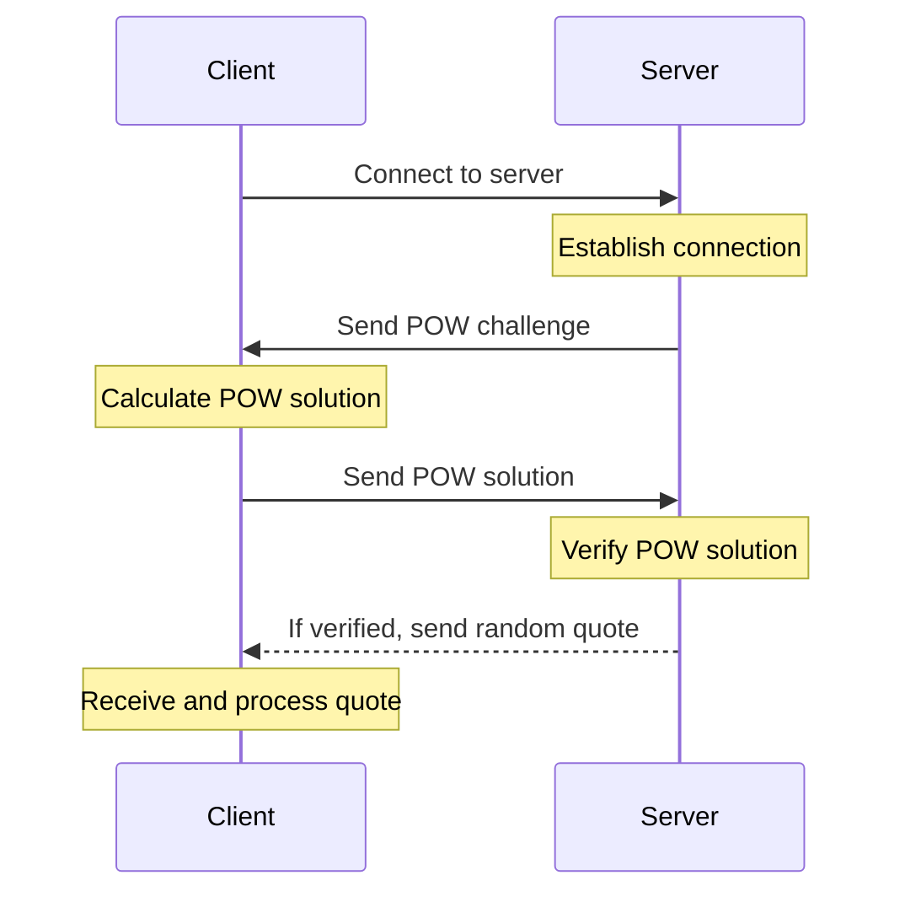

# Word of Wisdom

## Task

**Design and implement a “Word of Wisdom” tcp server**

- TCP server should be protected from DDOS attacks with the Proof of Work, the challenge-response protocol should be
  used.
- The choice of the POW algorithm should be explained
- After Prof Of Work verification, server should send one of the quotes from “word of wisdom” book or any other
  collection of the quotes
- Docker file should be provided both for the server and for the client that solves the POW challenge

## Sequence diagram

## Choice of Proof of Work Algorithm

For securing the "Word of Wisdom" TCP server against DDoS attacks, we've chosen the Hashcash algorithm. This decision
was based on its proven effectiveness in similar applications and its straightforward implementation. Below is a summary
of Hashcash's key advantages and disadvantages that influenced our choice:

| Advantages                                                                                         | Disadvantages                                                                                                |
|----------------------------------------------------------------------------------------------------|--------------------------------------------------------------------------------------------------------------|
| Simple to implement for server-client communication, doesn't require a central server.             | Requires clients to perform computational work, which could impact user experience on less powerful devices. |
| Effectively counters automated spam and DDoS attacks by imposing a computational cost on requests. | The computational cost might need periodic adjustment to balance security with accessibility.                |

This algorithm's ability to deter spam and mitigate DDoS risks by making them computationally expensive aligns with our
project's goals. Choosing Hashcash implies the use of a CPU-dependent puzzle in our project. This is suitable for
protection against DDoS attacks, as it requires significant computational effort from a potential attacker to send a
large number of requests to the server.

## Problems and possible solutions

- TCP connection keep alive while waiting for solution from clients. It can be the reason of server stop.

Solution: Close current tcp connection to free server resources, GRPC protocol can be used

- Connection multi opening with one challenge in case of closing connection

Solution: Store session of each client, delete challenge after usage

## Getting started

## Resources

<table>
<thead>
  <tr>
      <th><b>Resource</b></th>
      <th><b>Details</b></th>
  </tr>
</thead>
<tbody>
  <tr>
    <td><a href="https://en.wikipedia.org/wiki/Proof_of_work" target="_blank" rel="noopener noreferrer">Proof of work</a></td>
    <td>A form of cryptographic proof in which one party (the prover) proves to others (the verifiers) that a certain amount of a specific computational effort has been expended.</td>
  </tr>
  <tr>
    <td><a href="https://en.wikipedia.org/wiki/Hashcash" target="_blank" rel="noopener noreferrer">Hashcash</a></td>
    <td>A cryptographic hash-based proof-of-work algorithm that requires a selectable amount of work to compute.</td>
  </tr>
</tbody>
</table>

