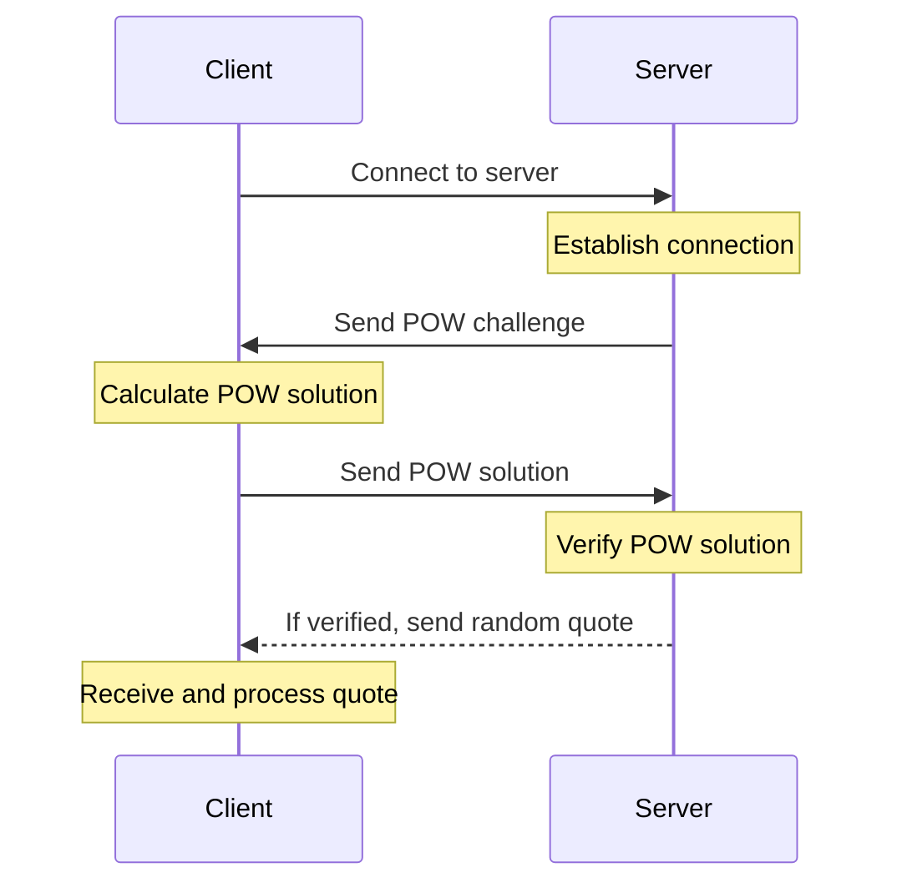

# Word of Wisdom

## Task

**Design and implement a “Word of Wisdom” tcp server**

- TCP server should be protected from DDOS attacks with the Proof of Work, the challenge-response protocol should be
  used.
- The choice of the POW algorithm should be explained
- After Prof Of Work verification, server should send one of the quotes from “word of wisdom” book or any other
  collection of the quotes
- Docker file should be provided both for the server and for the client that solves the POW challenge

## Sequence diagram



## Choice of Proof of Work Algorithm

We will use Hashcash as the PoW algorithm. It is simple and widely used in scenarios where the server needs to limit
client requests through computational effort.

This approach is computationally challenging for the client, making it harder to flood the server with requests, thus
mitigating DDoS attacks.

## Getting started

To run the project, you can use the provided `docker-compose` file. This will start the server and client containers.

```bash
make up
```

To stop the containers, run:

```bash
make down
```

## Resources

<table>
<thead>
  <tr>
      <th><b>Resource</b></th>
      <th><b>Details</b></th>
  </tr>
</thead>
<tbody>
  <tr>
    <td><a href="https://en.wikipedia.org/wiki/Proof_of_work" target="_blank" rel="noopener noreferrer">Proof of work</a></td>
    <td>A form of cryptographic proof in which one party (the prover) proves to others (the verifiers) that a certain amount of a specific computational effort has been expended.</td>
  </tr>
  <tr>
    <td><a href="https://en.wikipedia.org/wiki/Hashcash" target="_blank" rel="noopener noreferrer">Hashcash</a></td>
    <td>A cryptographic hash-based proof-of-work algorithm that requires a selectable amount of work to compute.</td>
  </tr>
</tbody>
</table>

